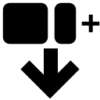

Save Tabs as HTML
=================

**Turn your browser chaos into a beautifully organized HTML dashboard.**

|Release| |License| |ChromeWebStore|

About
-----

**Save Tabs as HTML** is a powerful Chrome extension designed to declutter your browser and save your research sessions instantly. With a single click, it transforms all your open tabs into a structured, searchable, and aesthetically pleasing HTML file.

Whether you're a heavy researcher, a developer with 50+ tabs open, or just someone who likes to keep things organized, this tool ensures you never lose track of your browsing history again.

Features
--------

*   **🚀 Instant Reformatting**: Automatically converts your open tabs into a clean, three-column HTML dashboard.
*   **🎨 Dynamic Dark/Light Mode**: The generated HTML file respects your system theme preferences and includes a toggle for manual switching.
*   **🔍 Built-in Search**: Quickly find specific tabs within your saved file using the integrated search bar.
*   **📌 Smart Grouping**: 
    *   Groups tabs by **Window**.
    *   Highlights **Pinned** tabs.
    *   Displays **Favicons** for instant visual recognition.
*   **⚙️ Customizable Settings**:
    *   **Auto-Open & Close**: Automatically open your saved file and close all other tabs to free up memory.
    *   **Auto-Save**: Skip the "Save As" dialog and save directly to your Downloads folder.
*   **🔒 Privacy Focused**: Your data stays local. The HTML file is generated entirely within your browser—no data is sent to external servers.

How to Use
----------

1.  **Install the Extension**: Load the unpacked extension in Chrome Developer Mode or install from the Web Store (coming soon).
2.  **Click to Save**: Click the extension icon in your browser toolbar.
3.  **View Your Dashboard**: A new HTML file will be generated and downloaded. Open it to see your organized tabs!
4.  **Configure Preferences**: Right-click the extension icon -> **Options** to toggle auto-save and tab closing features.

Installation (Developer Mode)
-----------------------------

1.  Clone this repository or download the source code.
2.  Open Chrome and navigate to ``chrome://extensions/``.
3.  Enable **Developer mode** in the top right.
4.  Click **Load unpacked** and select the extension directory.

.. |Release| image:: https://img.shields.io/github/v/release/c1t1zen/save-chrome-tabs-as-html?style=flat-square
   :target: https://github.com/c1t1zen/save-chrome-tabs-as-html/releases
.. |License| image:: https://img.shields.io/github/license/c1t1zen/save-chrome-tabs-as-html?style=flat-square
   :target: LICENSE.txt
.. |ChromeWebStore| image:: https://img.shields.io/chrome-web-store/v/save-chrome-tabs-as-html?style=flat-square
   :target: https://chrome.google.com/webstore/detail/save-chrome-tabs-as-html
